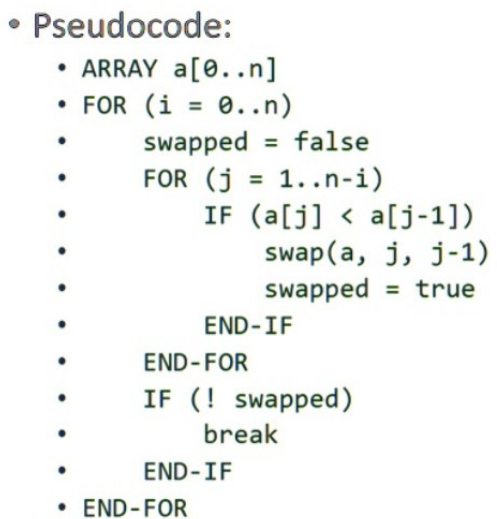
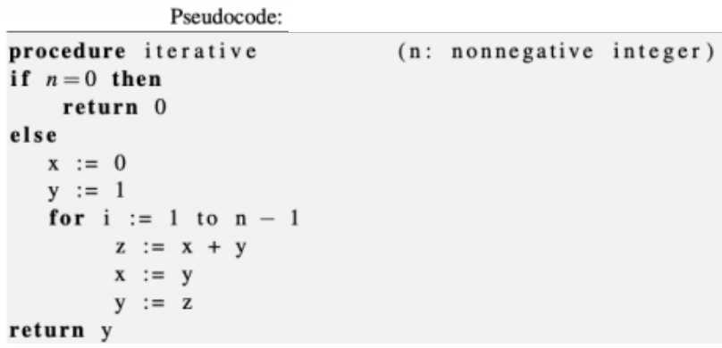
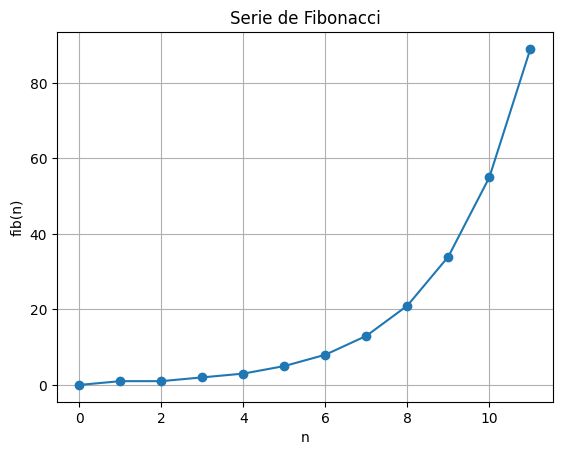
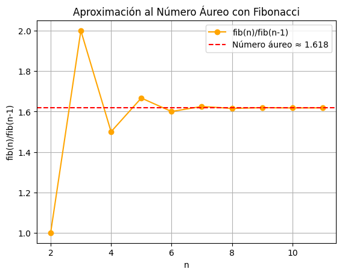
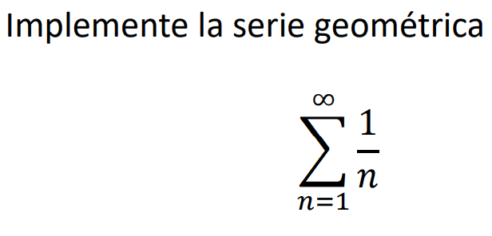
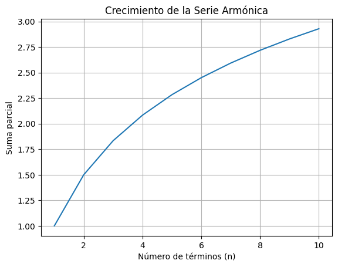

# Taller 01

- Richard Tipantiza 


Para más información acerca de más graficas entrar al [Repositorio](https://github.com/keyaru18/Taller1_MetodosNumericos.git) y observar el notebook para cada algortmo.

## Algoritmo 1


``` python
def alg_01(N, x):
    SUM = 0
    for i in range(N):
        SUM += x[i]
    return SUM
```
* $x = range(100) \rightarrow 4950$
* $x = [1, 1/2, 1/4] \rightarrow 1.75$

La sumatoria $1 + 1/2 + 1/4 +1/8 ... $ tal que el error absoluto $e_{abs} < 10^{-1}$.

``` python
v_real = 2
S = 0
n = 0
while True:
    i = 1 / (2**n)
    S += i
    n += 1
    print(f"Termino {n}: {i}, suma parcial: {S}")
    error_abs = abs(v_real - S)
    if error_abs < 10**-1:
        break
print(f"Suma final: {S}, con n={n} terminos, y error absoluto: {error_abs}")
```

``` cmd
Termino 1: 1.0, suma parcial: 1.0
Termino 2: 0.5, suma parcial: 1.5
Termino 3: 0.25, suma parcial: 1.75
Termino 4: 0.125, suma parcial: 1.875
Termino 5: 0.0625, suma parcial: 1.9375
Suma final: 1.9375, con n=5 terminos, y error absoluto: 0.0625
```

Entonces el mínimo de terminos para que el error sea menor a 0.1 es igual a 5.

## Algoritmo 2



### Corrida de escritorio
$v_1=[3, 2, 5, 8, 4, 1]$

| i | Vector |
| -- | -- |
| 0 | $ [3, 2, 5, 8, 4, 1] $ |
| 1 | $ [3, 2, 5, 4, 1, 8] $|
| 2 | $ [3, 2, 4, 1, 5, 8] $|
| 3 | $ [3, 2, 1, 4, 5, 8] $|
...

Resultado final:

$v_{sorted} = [1,2,3,4,5,8]$

```python
v1 = [3, 2, 5, 8, 4, 1] 
n = len(v1)

for i in range(n):
    swapped = False
    for j in range(1, n - i):
        if v1[j] < v1[j - 1]:
            v1[j], v1[j - 1] = v1[j - 1], v1[j]
            swapped = True
    if not swapped:
        break
print("V_sorted:", v1)
```

Casos de prueba:
* $v_2=[-1, 0, 4, 5, 6, 7]$

    V_sorted: [-1, 0, 4, 5, 6, 7]

* $v_3$ 100_000 número aleatorios entre -200 y 145.

    No lo hice con 100.000 valores ya que al ejecutarse el codigo se tarda mucho asi que solo use 100 números dentro del rango.

    ```python
    import random

    v3 = [random.randint(-200, 145) for _ in range(100)]
    ```

    V_3: [-34, -145, 60, -18, 42, -139, -177, -123, -149, 136, -72, 135, 23, -60, -130, -54, -51, -172, -49, 59, 64, -119, -123, -69, -143, 87, -37, 44, 94, -93, -51, -121, 75, 60, -50, -50, -52, 118, 90, 0, 137, 120, -37, 16, -165, -52, 44, 9, -200, -161, 29, 31, 136, 63, -112, -74, -120, 2, 54, -111, -70, -121, -178, 49, 31, -73, 82, -133, -114, -28, 138, -84, -182, 145, -180, -51, -92, -191, 101, 86, -187, 25, 30, 73, 68, -193, 138, 85, -198, -161, -75, -138, -88, -118, -9, 57, 82, 98, 104, 128]
    V_sorted: [-200, -198, -193, -191, -187, -182, -180, -178, -177, -172, -165, -161, -161, -149, -145, -143, -139, -138, -133, -130, -123, -123, -121, -121, -120, -119, -118, -114, -112, -111, -93, -92, -88, -84, -75, -74, -73, -72, -70, -69, -60, -54, -52, -52, -51, -51, -51, -50, -50, -49, -37, -37, -34, -28, -18, -9, 0, 2, 9, 16, 23, 25, 29, 30, 31, 31, 42, 44, 44, 49, 54, 57, 59, 60, 60, 63, 64, 68, 73, 75, 82, 82, 85, 86, 87, 90, 94, 98, 101, 104, 118, 120, 128, 135, 136, 136, 137, 138, 138, 145]

- Modifique el Algoritmo y determine el número de comparaciones realizadas al ordenar la serie 54321
```python
v4 = [5, 4, 3, 2, 1]
n = len(v4)
comparisons = 0
for i in range(n):
    swapped = False
    for j in range(1, n - i):
        comparisons += 1
        if v4[j] < v4[j - 1]:
            v4[j], v4[j - 1] = v4[j - 1], v4[j]
            swapped = True
    if not swapped:
        break

print("V_sorted:", v4)
print("Número de Comparaciones:", comparisons)
```

```cmd
V_sorted: [1, 2, 3, 4, 5]
Número de Comparaciones: 10
```

## Algoritmo 3



```python
def alg_03(n):
    if n == 0:
        return 0
    x = 0
    y = 1
    for i in range(1, n):
        z = x + y
        x = y
        y = z
    return y
```

| n | fib(n) |
| -- | -- |
| 0 | 0 |
| 1 | 1 |
| 2 | 1 |
| 3 | 2 |
| 4 | 3 |
| 5 | 5 |
| 6 | 8 |
| 6 | 13 |
| ... | ... |
|$n = 11 $ | 89 |
|$n = 84 $ | 160500643816367088 |
|$n = 1531$ | 4079361760523776691... |

## Graficar!
* El valor de la serie $fib(n)$

```python
import matplotlib.pyplot as plt

n = 11
fibs = [alg_03(i) for i in range(n+1)]v

plt.plot(range(n+1), fibs, marker='o')
plt.title("Serie de Fibonacci")
plt.xlabel("n")
plt.ylabel("fib(n)")
plt.grid(True)
plt.show()
```


* El valor del cociente 

    $\phi \rightarrow \frac{fib(n)} {fib(n-1)} \approx 1.618$ número áureo.


| n | $ \frac{fib(n)}{fib(n-1)} $ |
| -- | -- |
| 2 | $1/1=1 $ |
| 3 | $2/1 = 2$ |
| 4 | $3/2 = 1.5$ |
| 5 | $5/3= 1.66667$ |
| 6 | $8/5= 1.6$ |
| 7 | $13/8 = 1.625 $ |
| 8 | $21/13 = 1.615 $ |
| ... | ... |
|$\infty $ | $ \frac{1 + \sqrt{5}} {2} \approx 1.618$ (número áureo) |

```python
n = 11

phi_values = [alg_03(i)/alg_03(i-1) for i in range(2, n+1)]

plt.plot(range(2, n+1), phi_values, marker='o', color='orange', label='fib(n)/fib(n-1)')
plt.axhline(y=1.61803398875, color='r', linestyle='--', label='Número áureo ≈ 1.618')
plt.title("Aproximación al Número Áureo con Fibonacci")
plt.xlabel("n")
plt.ylabel("fib(n)/fib(n-1)")
plt.grid(True)
plt.legend()
plt.show()
```


Usando el Algoritmo y la aritmética de redondeo con 3 cifras determine la iteracíon desde la cual el error relativo de $\frac{y_{i-1}}{yi}$ $(i>0)$ con respecto a $\frac{1+\sqrt{5}}{2}$  esta dentro de $10^{-5}$

```python

import math

# Función para redondear a un número de cifras significativas
def round_sig(x, sig=3):
    if x == 0:
        return 0.0
    sign = 1 if x > 0 else -1
    x_abs = abs(x)
    exp = math.floor(math.log10(x_abs))
    factor = 10**(sig - 1 - exp)
    return sign * round(x_abs * factor) / factor

# Número áureo φ y su inverso (1/φ)
phi = (1 + math.sqrt(5)) / 2
inv_phi = 1 / phi

# Algoritmo tipo Fibonacci con redondeo a 3 cifras significativas
x = 0.0
y = 1.0

print(" i\t y_(i-1)\t\t\ty_i\t\t ratio y_(i-1)/y_i\t error relativo")

for i in range(1, 25):  # hasta la iteración 24
    z = round_sig(x + y, 3)  # suma redondeada a 3 cifras significativas
    x = round_sig(y, 3)
    y = round_sig(z, 3)

    # calculamos la razón (sin redondear la división)
    ratio = x / y
    rel_error = abs((ratio - inv_phi) / inv_phi)

    print(f"{i:2d}\t {x:.6f}\t {y:.6f}\t {ratio:.9f}\t\t {rel_error:.9e}")

    # condición de parada
    if rel_error <= 1e-5:
        print(f"\n✅ A partir de la iteración {i}, el error relativo ≤ 10⁻⁵.")
        break
```

```cmd
i	 y_(i-1)			y_i		 ratio y_(i-1)/y_i	 error relativo
 1	 1.000000	 1.000000	 1.000000000		 6.180339887e-01
 2	 1.000000	 2.000000	 0.500000000		 1.909830056e-01
 3	 2.000000	 3.000000	 0.666666667		 7.868932583e-02
 4	 3.000000	 5.000000	 0.600000000		 2.917960675e-02
 5	 5.000000	 8.000000	 0.625000000		 1.127124297e-02
 6	 8.000000	 13.000000	 0.615384615		 4.286776154e-03
 7	 13.000000	 21.000000	 0.619047619		 1.640088274e-03
 8	 21.000000	 34.000000	 0.617647059		 6.260657721e-04
 9	 34.000000	 55.000000	 0.618181818		 2.391930454e-04
10	 55.000000	 89.000000	 0.617977528		 9.135526692e-05
11	 89.000000	 144.000000	 0.618055556		 3.489582459e-05
12	 144.000000	 233.000000	 0.618025751		 1.332884127e-05
13	 233.000000	 377.000000	 0.618037135		 5.091190253e-06

✅ A partir de la iteración 13, el error relativo ≤ 10⁻⁵.
```

## Algoritmo 4


```python
# Serie armónica: sumatoria desde n = 1 hasta un número grande

n = int(input("¿Cuántos términos quieres sumar? "))

suma = 0.0 

for i in range(1, n + 1):
    suma += 1 / i  

print(f"La suma de los primeros {n} términos es: {suma}")

```

```cmd
La suma de los primeros 10 términos es: 2.9289682539682538
```

### ¿A que valor converge el algoritmo 4?
El **algoritmo 4** (que implementa la serie armónica)

$\sum_{n=1}^{\infty} \frac{1}{n}$

**no converge** a ningún valor finito.

- Esta serie se llama **serie armónica**.  
- Su suma **crece sin límite** (aunque lentamente).  
- Por lo tanto, el algoritmo **diverge al infinito**.

### Ejemplo de valores parciales

| n       | Suma aproximada |
|----------|-----------------|
| 10       | 2.9289          |
| 100      | 5.1873          |
| 1000     | 7.4854          |
| 10000    | 9.7876          |

A medida que \( n \) aumenta, la suma sigue creciendo indefinidamente.
