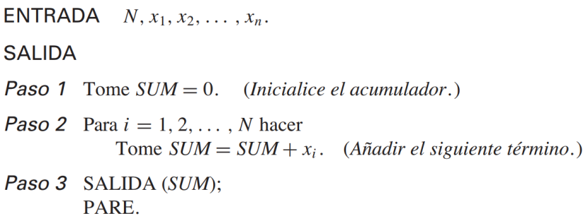

# Taller 01

- Richard Tipantiza 

[Repositorio](https://github.com/keyaru18/Taller1_MetodosNumericos.git)

## Algoritmo 1



``` python
def alg_01(N, x):
    SUM = 0
    for i in range(N):
        SUM += x[i]
    return SUM
```
* $x = range(100) \rightarrow 4950$
* $x = [1, 1/2, 1/4] \rightarrow 1.75$

La sumatoria $1 + 1/2 + 1/4 +1/8 ... $ tal que el error absoluto $e_{abs} < 10^{-1}$.

``` python
n1 = 4
error1 = 2**(1 - n1)
print(f"Para n={n1}: Error={error1} (lo cual es > 0.1)")

n2 = 5
error2 = 2**(1 - n2)
print(f"Para n={n2}: Error={error2} (lo cual es < 0.1)")
```

``` cmd
Para n=4: Error=0.125 (lo cual es > 0.1)
Para n=5: Error=0.0625 (lo cual es < 0.1)
```

Entonces el mínimo de terminos para que el error sea menor a 0.1 es igual a 5.

## Algoritmo 2


### Corrida de escritorio
$v_1=[3, 2, 5, 8, 4, 1]$

| i | Vector |
| -- | -- |
| 0 | $ [3, 2, 5, 8, 4, 1] $ |
| 1 | $ [3, 2, 5, 4, 1, 8] $|
| 2 | $ [3, 2, 4, 1, 5, 8] $|
| 3 | $ [3, 2, 1, 4, 5, 8] $|
...

Resultado final:

$v_{sorted} = [1,2,3,4,5,8]$

```python
v1 = [3, 2, 5, 8, 4, 1] 
n = len(v1)

for i in range(n):
    swapped = False
    for j in range(1, n - i):
        if v1[j] < v1[j - 1]:
            v1[j], v1[j - 1] = v1[j - 1], v1[j]
            swapped = True
    if not swapped:
        break
print("V_sorted:", v1)
```

Casos de prueba:
* $v_2=[-1, 0, 4, 5, 6, 7]$

    V_sorted: [-1, 0, 4, 5, 6, 7]

* $v_3$ 100_000 número aleatorios entre -200 y 145.

    No lo hice con 100.000 valores ya que al ejecutarse el codigo se tarda mucho asi que solo use 100 números dentro del rango.

    ```python
    import random

    v3 = [random.randint(-200, 145) for _ in range(100)]
    ```

    V_3: [-34, -145, 60, -18, 42, -139, -177, -123, -149, 136, -72, 135, 23, -60, -130, -54, -51, -172, -49, 59, 64, -119, -123, -69, -143, 87, -37, 44, 94, -93, -51, -121, 75, 60, -50, -50, -52, 118, 90, 0, 137, 120, -37, 16, -165, -52, 44, 9, -200, -161, 29, 31, 136, 63, -112, -74, -120, 2, 54, -111, -70, -121, -178, 49, 31, -73, 82, -133, -114, -28, 138, -84, -182, 145, -180, -51, -92, -191, 101, 86, -187, 25, 30, 73, 68, -193, 138, 85, -198, -161, -75, -138, -88, -118, -9, 57, 82, 98, 104, 128]
    V_sorted: [-200, -198, -193, -191, -187, -182, -180, -178, -177, -172, -165, -161, -161, -149, -145, -143, -139, -138, -133, -130, -123, -123, -121, -121, -120, -119, -118, -114, -112, -111, -93, -92, -88, -84, -75, -74, -73, -72, -70, -69, -60, -54, -52, -52, -51, -51, -51, -50, -50, -49, -37, -37, -34, -28, -18, -9, 0, 2, 9, 16, 23, 25, 29, 30, 31, 31, 42, 44, 44, 49, 54, 57, 59, 60, 60, 63, 64, 68, 73, 75, 82, 82, 85, 86, 87, 90, 94, 98, 101, 104, 118, 120, 128, 135, 136, 136, 137, 138, 138, 145]

## Algoritmo 3


```python
def alg_03(n):
    if n == 0:
        return 0
    x = 0
    y = 1
    for i in range(1, n):
        z = x + y
        x = y
        y = z
    return y
```

| n | fib(n) |
| -- | -- |
| 0 | 0 |
| 1 | 1 |
| 2 | 1 |
| 3 | 2 |
| 4 | 3 |
| 5 | 5 |
| 6 | 8 |
| 6 | 13 |
| ... | ... |
|$n = 11 $ | 89 |
|$n = 84 $ | 160500643816367088 |
|$n = 1531$ | 4079361760523776691... |

## Graficar!
* El valor de la serie $fib(n)$

```python
import matplotlib.pyplot as plt

n = 11
fibs = [alg_03(i) for i in range(n+1)]

plt.plot(range(n+1), fibs, marker='o')
plt.title("Serie de Fibonacci")
plt.xlabel("n")
plt.ylabel("fib(n)")
plt.grid(True)
plt.show()
```


* El valor del cociente 

    $\phi \rightarrow \frac{fib(n)} {fib(n-1)} \approx 1.618$ número áureo.


| n | $ \frac{fib(n)}{fib(n-1)} $ |
| -- | -- |
| 2 | $1/1=1 $ |
| 3 | $2/1 = 2$ |
| 4 | $3/2 = 1.5$ |
| 5 | $5/3= 1.66667$ |
| 6 | $8/5= 1.6$ |
| 7 | $13/8 = 1.625 $ |
| 8 | $21/13 = 1.615 $ |
| ... | ... |
|$\infty $ | $ \frac{1 + \sqrt{5}} {2} \approx 1.618$ (número áureo) |

```python
n = 11

phi_values = [alg_03(i)/alg_03(i-1) for i in range(2, n+1)]

plt.plot(range(2, n+1), phi_values, marker='o', color='orange', label='fib(n)/fib(n-1)')
plt.axhline(y=1.61803398875, color='r', linestyle='--', label='Número áureo ≈ 1.618')
plt.title("Aproximación al Número Áureo con Fibonacci")
plt.xlabel("n")
plt.ylabel("fib(n)/fib(n-1)")
plt.grid(True)
plt.legend()
plt.show()
```


